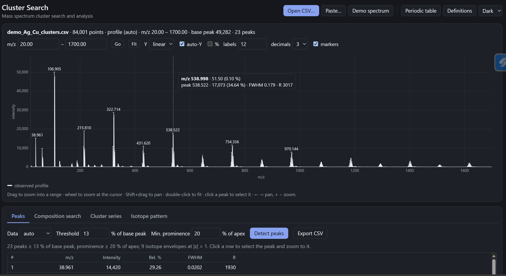
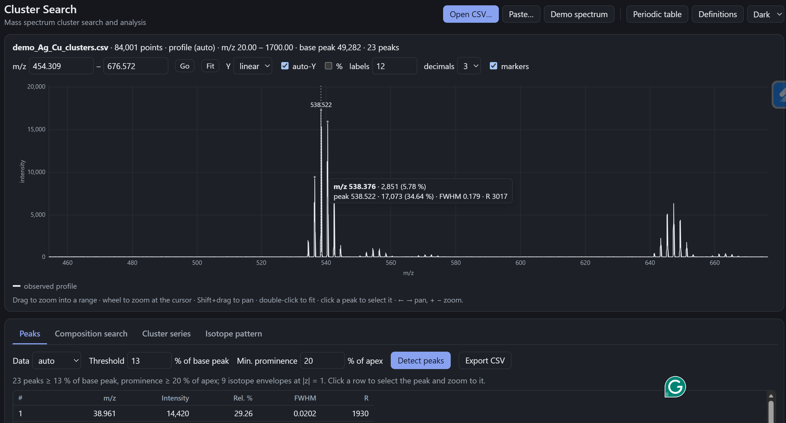
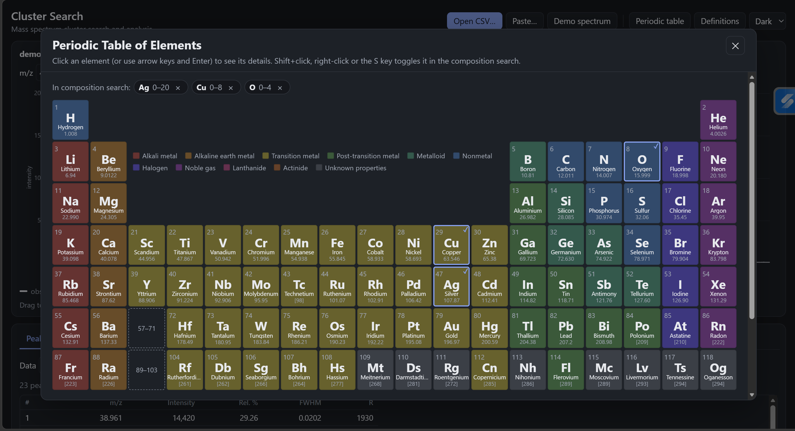
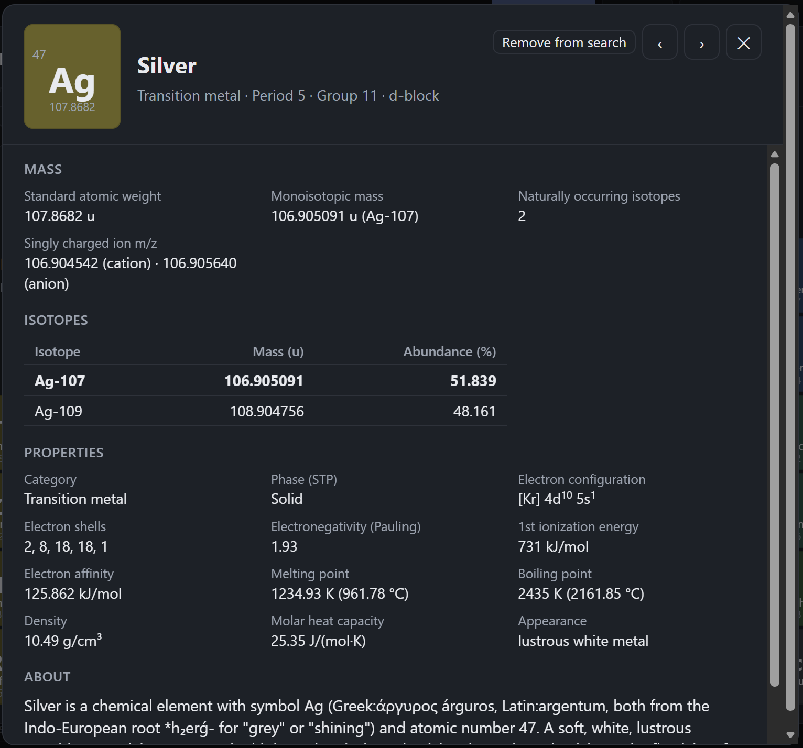

# Cluster Search

Mass spectrum cluster search and analysis, with a periodic table of elements. Two self-contained HTML pages plus a synthetic demo spectrum. No build step, no dependencies, no network access: open either file in a modern browser.

| File | What it is |
|------|------------|
| `ClusterSearch.html` | Mass spectrum cluster search and analysis: load a spectrum, detect peaks, search compositions against a target m/z, find cluster series with a repeating unit, and compute isotope patterns. Includes the periodic table as an element-picker dialog. |
| `PeriodicTable.html` | Stand-alone periodic table in the standard 18-column layout. Click an element (or use the arrow keys and Enter) to open a details dialog with masses, isotopes, and properties. |
| `demo_Ag_Cu_clusters.csv` | Synthetic profile spectrum (m/z 20–1700, 0.02 m/z sampling, Gaussian peaks at resolving power 3000 with Gaussian and shot noise): Agn+ (n = 1–15), Cun+ (n = 1–4), AgnO+, AgnO2+, AgnCu+ (n = 1–3), Na+, K+. The same spectrum is generated in-page by the **Demo spectrum** button. |

## Screenshots

The demo spectrum in `ClusterSearch.html` with its 23 detected peaks labelled; the hover readout gives the sample under the cursor and the nearest detected peak's intensity, FWHM and resolving power.

Zoomed to m/z 454–677: the Ag5+ isotope envelope (apex 538.522), the weaker Ag5O+ envelope beside it, and Ag6+ at the right.

The periodic table dialog in `ClusterSearch.html`, with Ag, Cu and O selected for the composition search and their count ranges shown.

The element details dialog (silver): standard atomic weight, monoisotopic mass, singly charged ion m/z, isotopes with masses and abundances, and properties.

## Background

In the early 1990s, I designed and implemented a cluster search and analysis system for a mass spectrometer: about 5,000 lines of C for MS-DOS. It included a helper periodic table dialog showing all elements in the standard periodic table view; clicking an element opened another dialog with its details. These pages are a browser-based re-creation of that system done via Claude Fable 5.1 Extra.

## Cluster Search

**Input.** Open a CSV, paste two numeric columns (m/z and intensity; comma, semicolon, tab or space separated; header lines and `#` comments are ignored), or load the demo spectrum. Profile and centroid data are handled; auto mode classifies a spectrum as profile when it has at least 200 points and the median spacing of consecutive points is below 0.1.

**Spectrum view.** Drag to zoom into a range, wheel to zoom at the cursor, Shift+drag to pan, double-click to fit, click a peak to select it. Linear, square-root or log intensity axis; optional peak labels and markers.

**Peaks.** Local maxima above a threshold (% of base peak) with a minimum prominence (% of apex). Peak m/z is the vertex of the parabola fitted through the natural logarithm of the apex sample and its two neighbours (exact for a Gaussian peak). FWHM and resolving power R = (m/z)/FWHM are reported for profile data. Consecutive peaks at most 2.15/|z| apart form an isotope envelope, with an apex and an intensity-weighted centroid.

**Composition search.** Choose elements (from the periodic table dialog) with count ranges, a charge z and a tolerance (Da or ppm). All compositions within the ranges are enumerated (bounded by the lightest and heaviest isotope of each element, capped at 200,000 evaluated compositions); those whose isotope pattern has a peak within tolerance of the target m/z are kept and ranked by pattern fit, the cosine similarity between theoretical and observed relative intensities. The target is the selected peak or every isotope envelope apex.

**Cluster series.** Nodes (envelope centroids, envelope apexes or all peaks) at m/zk = m/z0 + k·Δ/|z| for a unit mass Δ: the average mass of a unit formula, its monoisotopic mass, or a custom value. Chains are grown from the lightest unused node, with an allowed number of missing members; a least-squares fit of m/z against k gives the measured spacing and residual. The first member's neutral mass is decomposed as n·Δ + core; a non-zero core can be searched as a neutral composition. **Find spacings** lists the recurring pairwise m/z differences among the most intense nodes, with elements and common units whose mass matches.

**Isotope pattern.** For a formula and charge, the isotopologue distribution by convolution of natural isotopic abundances, with abundance-weighted merging of peaks closer than the merge width. Can be overlaid on the spectrum or used as the series unit.

All result tables export to CSV. The **Definitions** dialog gives the exact terms as used on the page. m/z = (M − z·me)/|z| with me = 5.485 799 09 × 10−4 u (CODATA 2018). Settings are kept in the browser's local storage.

## Data sources

- Isotopic masses: AME2020 (Wang et al. 2021).
- Isotopic abundances: CIAAW "Isotopic compositions of the elements 2021"; where CIAAW gives a range, the representative value is used.
- Standard atomic weights: IUPAC 2021 (Prohaska et al. 2022); the conventional value is used where the standard atomic weight is an interval; a bracketed value is the mass number of the longest-lived isotope of an element with no stable isotopes.

All three via the [`periodictable`](https://pypi.org/project/periodictable/) Python package v2.1.0, except uranium abundances, which that package omits and which are taken directly from CIAAW representative values.

- Element properties (electron configuration, electronegativity, phase, melting and boiling points, density, ionization energy, electron affinity, molar heat, descriptions): [Bowserinator/Periodic-Table-JSON](https://github.com/Bowserinator/Periodic-Table-JSON), a Wikipedia-derived dataset; treat those values as approximate.

Monoisotopic mass throughout means the mass of the most abundant naturally occurring isotope.

## License

[MIT](LICENSE).
